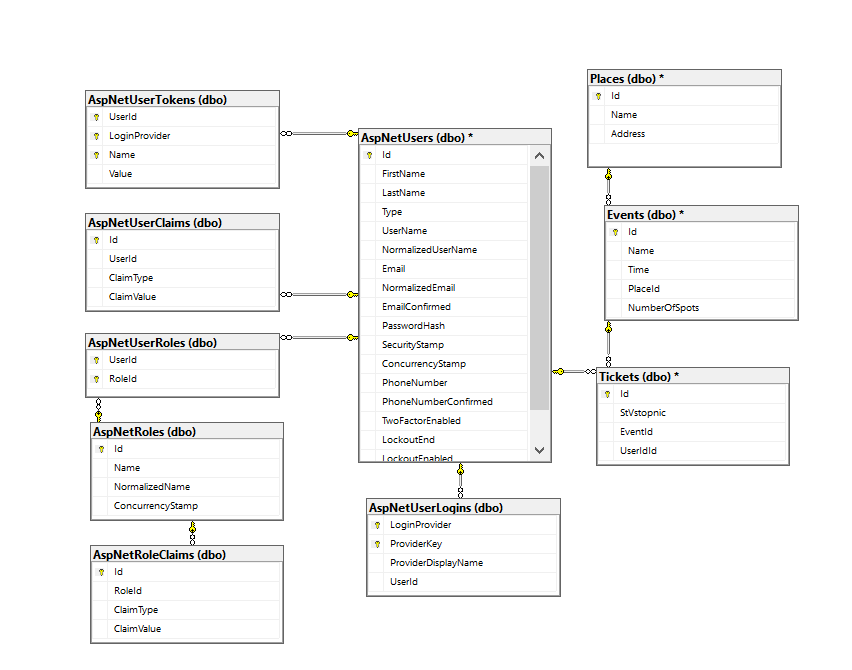
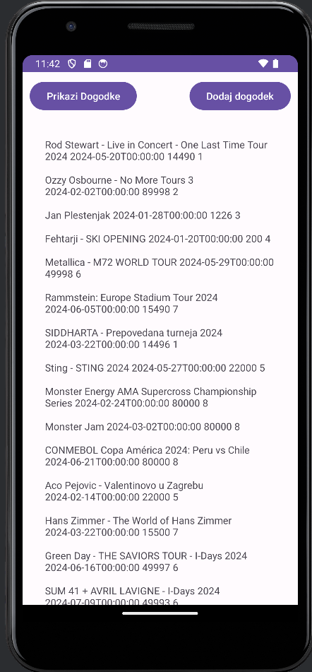
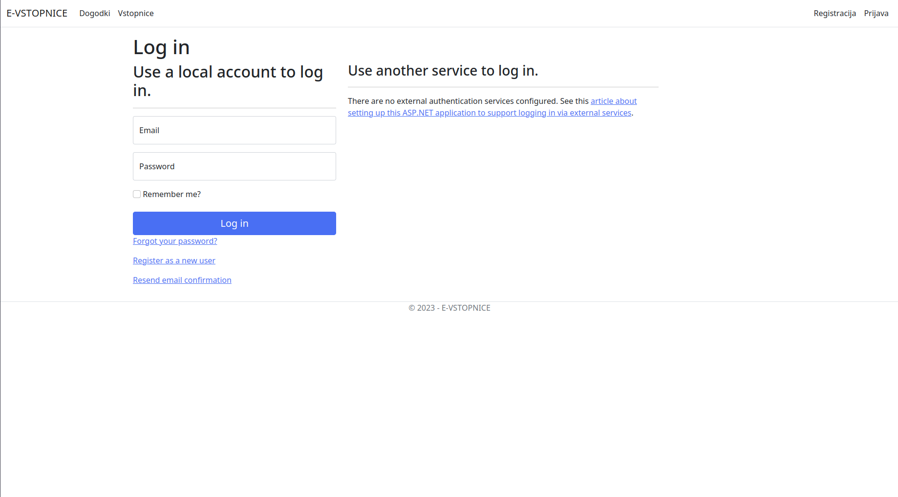
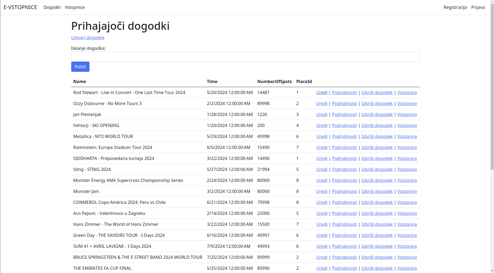
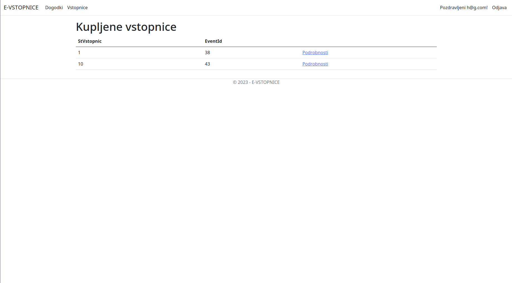

# e-Vstopnice
Naslov seminarske naloge: E-VSTOPNICE

## ČLANA EKIPE:
63220274 Žan Reščič
63220513 Mark Škof

## OPIS IS:
Informacijski sistem za nakup kart za razne dogodke.
IS omogoča ogled dogodkov, nakup kart za specifičen dogodek, ustvarjanje dogodkov, pregled nakupljenih kart.
Predvidene entitete: Uporabnik, Event, Prostor, Karta.

## RAZDELITEV DELA
Mark:
  - postavil temelje spletne aplikacije in naredil mobilno aplikacijo
Žan
  - naredil spletno aplikacijo in API-je, in postavitev vseh storitev azurja

## Slike

### Shema podatkovne baze

### UI mobilne aplikacije (prikaz dogodkov)

### UI mobilne aplikacije (dodaja dogodka)

### UI web aplikacije (login)

### UI web aplikacije (prikaz dogodkov)

### UI web aplikacije (prikaz vstopnic)

